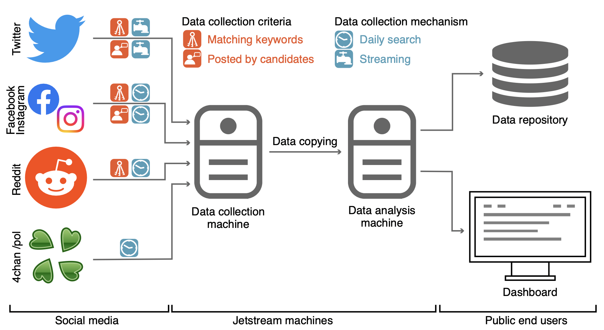

# Introduction

Here we release MEIU22, a collection of cross-platform social media posts about the 2022 U.S. midterm elections.
Details can be found in our paper [A multi-platform collection of social media posts about the 2022 U.S. midterm elections](https://arxiv.org/abs/2301.06287).



# Repo structure
- [/code](/code): code used to collect the data
- [/data](/data): collected data

# Citation

If you use our data or code in your research, please cite our work as follows:

```bib
@article{deverna2023multiplatform,
  author = {Rachith Aiyappa and Matthew R. DeVerna and Manita Pote and Bao Tran Truong and Wanying Zhao and David Axelrod and Aria Pessianzadeh and Zoher Kachwala and Munjung Kim and Ozgur Can Seckin and Minsuk Kim and Sunny Gandhi and Amrutha Manikonda and Francesco Pierri and Filippo Menczer and Kai-Cheng Yang},
  title = {A multi-platform collection of social media posts about the 2022 U.S. midterm elections},
  year = {2023},
  journal = {Proceedings of the International AAAI Conference on Web and Social Media}
}
```
